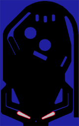

== Pixie Pinball Engine

The idea is a pinball game engine utilizing oldschool pixel collisions and bitmaps for levels.

The engine has to be deterministic.

== Engine
=== Physics
Collision Layer:: 
+
All collisions are handled pixel by pixel, we use a collection of spritemaps to calculate collisions.
+

